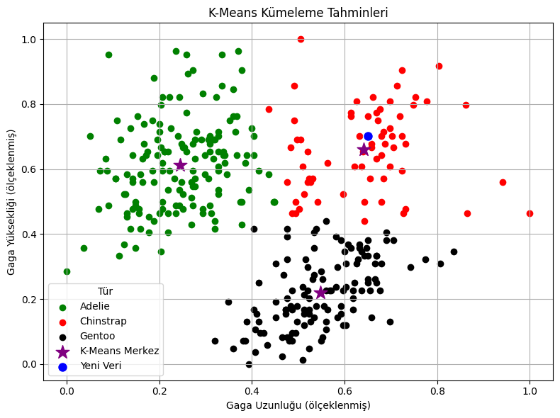
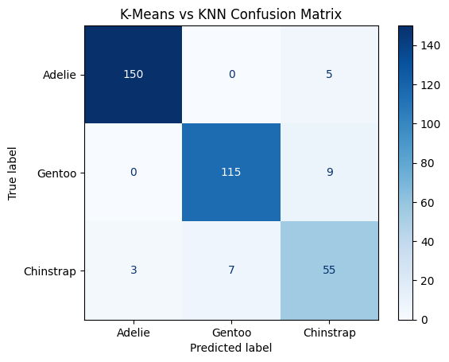

# 🐧 Penguin Species Classifier with K-Means and KNN

Bu proje, Palmer Penguins veri setini kullanarak makine öğrenmesi algoritmalarının tür sınıflandırma yeteneklerini karşılaştırmayı hedefler. Bu sayede hem denetimli hem de denetimsiz öğrenme yaklaşımlarının biyolojik veriler üzerindeki etkileri incelenir.

---

## 🎯 Proje Amaçları

- Penguen türlerini K-Means ve KNN ile sınıflandırmak.
- Denetimli ve denetimsiz yöntemlerin sonuçlarını karşılaştırmak
- Confusion Matrix ile model performansını görselleştirmek

---

## 📁 Proje Yapısı

```
Penguin-Species-Classifier-with-K-Means-and-KNN/
│
├── data/                           # Veri dosyalarının bulunduğu klasör (isteğe bağlı)
│   └── penguins.csv                # Temel veri seti
│
├── images/                         # Grafik çıktılarının tutulduğu klasör (isteğe bağlı)
│   └── kmeans_output.png           # Örnek bir çıktı görseli
│
├── palmerpenguins_kmeansclustering-knn.ipynb   # Jupyter Notebook dosyası
├── main.py                         # Konsol arayüzünden çalıştırılan Python dosyası
├── requirements.txt                # Gerekli Python kütüphaneleri listesi
├── README.md                       # Projenin dökümantasyon dosyası
├── LICENSE                         # MIT Lisansı
└── project_structure.txt           # Bu proje yapısı dosyası
```

---

## 📷 Grafikler

### K-Means Sonuç Görselleştirmesi:


 - Yeni Veri :Kullanıcıdan alınan gaga uzunluğu 50mm, gaga yüksekliği 19mm olan penguen

 - K-Means Modeli Doğruluğu: 93.31%


### KNN Tahmin Sonucu:


 - Yeni Veri :Kullanıcıdan alınan gaga uzunluğu 50mm, gaga yüksekliği 19mm olan penguen

 - KNN Modeli Doğruluğu: 96.22%

### K-Means KNN Confusion Matrix Tablosu :


K-Means ve KNN tahminlerinin uyum oranı: 93.60%

---

## 📊 Kullanılan Yöntemler

🔹 K-Means (K-Ortalamalar) Kümeleme
K-Means, denetimsiz bir makine öğrenmesi algoritmasıdır. Veri noktalarını benzerliklerine göre **önceden belirlenmiş K adet kümeye** ayırır. Bu projede penguenlerin `gaga uzunluğu` ve `gaga yüksekliği` kullanılarak tür tahmini yapılır.

🔹 KNN (K-Nearest Neighbors)
KNN, denetimli bir öğrenme algoritmasıdır. Yeni bir örnek, eğitim setindeki **en yakın K komşusuna** göre sınıflandırılır. Bu projede kullanıcıdan alınan ölçümlere göre penguen türü tahmin edilir.

---

## ⚙️ Kurulum

Projeyi çalıştırmak için aşağıdaki adımları izleyin:

```
git clone https://github.com/ErenMeseli/Penguin-Species-Classifier-with-K-Means-and-KNN.git
cd Penguin-Species-Classifier-with-K-Means-and-KNN
pip install -r requirements.txt
```

## ▶️ Kullanım
🔬 Notebook Üzerinden:
palmerpenguins_kmeansclustering-knn.ipynb dosyasını Jupyter Notebook veya Google Colab’da açın.

Hücreleri sırasıyla çalıştırın.

Gaga uzunluğu, gaga yüksekliği ve K değeri gibi verileri girerek sınıflandırmayı deneyin.

## 🖥️ Konsol Üzerinden:
main.py dosyasını çalıştırın:

```
python main.py
```

İstenen kullanıcı girişlerini yaptıktan sonra, model tahmini ve sonuçlar görüntülenecektir.

## 📈 Sonuçlar
K-Means ve KNN algoritmalarının başarı oranları karşılaştırılır.

Confusion Matrix yardımıyla tahmin doğruluğu görselleştirilir.

İki algoritmanın tahminleri arasındaki benzerlik analiz edilir.

## 📦 Kullanılan Kütüphaneler

- **pandas**: Veri işleme
- **numpy**: Sayısal hesaplamalar
- **scikit-learn**: Makine öğrenimi algoritmaları
- **matplotlib**: Grafik ve görselleştirme

## 📚 Veri Seti
Palmer Penguins veri seti, palmerpenguins R paketi kaynaklıdır ve aşağıdaki üç penguen türüne ait biyolojik ölçümleri içerir:

 - **Adelie**
 - **Chinstrap**
 - **Gentoo**

Özellikler arasında gaga uzunluğu, gaga yüksekliği, vücut kütlesi ve yüzgeç uzunluğu gibi bilgiler bulunmaktadır.

## ✍️ Yazar
**Eren Meşeli**  

🔗 [GitHub Profilim](https://github.com/ErenMeseli)

## 📝 Lisans
Bu proje **MIT Lisansı** ile lisanslanmıştır. Detaylar için `LICENSE` dosyasına göz atabilirsiniz.

## 🔗 Ek Kaynaklar

- [Palmer Penguins Dataset](https://allisonhorst.github.io/palmerpenguins/)
- [Scikit-learn Belgeleri](https://scikit-learn.org/stable/documentation.html)

